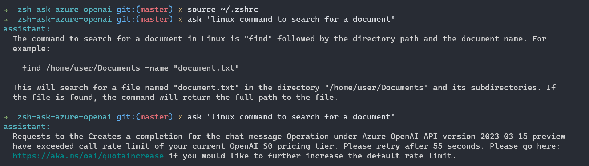
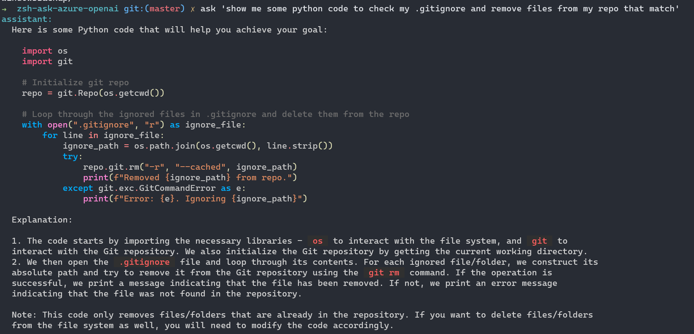

# zsh-ask

A lightweight Zsh plugin serves as a ChatGPT API frontend, enabling you to interact with ChatGPT directly from the `Zsh` shell using only `cURL` and `jq`.

 

## Changelog

- **Version 0.0.2-beta:**
  - Works with Azure Open AI Service
  - Added error handling for AOI Rate limiting or parsing errors
  - Improved Readme/Install instructions

## Installation

See [INSTALL.md](INSTALL.md).

## Pre-requisites

Please ensure you have the following:

- An Azure Open AI service account with a deployed GPT-3.5 model.
- The OpenAI Key and OpenAI URL for your Azure Open AI service deployment.

If you haven't set up an Azure Open AI service account and deployed the GPT-3.5 model, follow these steps:

1. Sign in to the Azure portal at [https://portal.azure.com](https://portal.azure.com).
2. Create a new Azure Open AI resource. Learn how to create an Azure Open AI resource with this [Microsoft Learn guide](https://docs.microsoft.com/learn/modules/get-started-with-azure-ai-text-api/).
3. Follow the instructions to deploy the GPT-3.5 model within your Azure Open AI service. Refer to the [Microsoft Learn guide](https://docs.microsoft.com/learn/modules/deploy-language-model-with-text-api/) for detailed steps on deploying the GPT-3.5 model.

Retrieve the OpenAI Key and OpenAI URL from your Azure Open AI service account.

Install zsh shell if you haven't already:
    
```bash
sudo apt install zsh
```

Set it as your default shell: (optional)
    
```bash
chsh -s $(which zsh)
```

You can also install [oh-my-zsh](https://ohmyz.sh/#install) if you want to.

Make sure you have [`cURL`](https://curl.se/) and [`jq`](https://stedolan.github.io/jq/) installed.

If you would like to have markdown rendering with option `-m`, [`glow`](https://github.com/charmbracelet/glow) is required (Recommend).

## Usage

```bash
ask '<your prompt>'
```

Use `-c` for dialogue format communication (BETA)

```bash
ask -c
```

Use `-m` for markdown rendering (glow required)

```bash
ask -m
```

Use `-h` for more information.

```bash
ask -h
```

Use `-d` to turn on debug mode.

```bash
ask -d
```